 

## Hashnode Blog Posts 📘
<!-- HASHNODE_BLOG:START -->
- [Common Mistakes in Conditional Rendering](https://jason60810.hashnode.dev/common-mistakes-in-conditional-rendering)
- [Always Use a Custom Hook for Context API, Not useContext &lpar;React Context API, TypeScript&rpar;](https://jason60810.hashnode.dev/always-use-a-custom-hook-for-context-api-not-usecontext-react-context-api-typescript)
- [LeetCode - 21. Merge Two Sorted Lists](https://jason60810.hashnode.dev/leetcode-21-merge-two-sorted-lists)
- [Using REST APIs with Protobuf in a Next.js and TypeScript App &lpar;Backend in Go&rpar;](https://jason60810.hashnode.dev/using-rest-apis-with-protobuf-in-a-nextjs-and-typescript-app-backend-in-go)
- [Next.js Tutorial For Beginners](https://jason60810.hashnode.dev/nextjs-tutorial-for-beginners)
- [React Hooks Simplified](https://jason60810.hashnode.dev/react-hooks-simplified-103c8601ba6e)
- [Section 2: Block Scoping](https://jason60810.hashnode.dev/section-2-block-scoping-af630067c440)
- [Svelte State Management Guide](https://jason60810.hashnode.dev/svelte-state-management-guide-d686d61e7d0a)
- [This is why you should lazy load routes and components in Vue](https://jason60810.hashnode.dev/this-is-why-you-should-lazy-load-routes-and-components-in-vue-9e64de19f28)
- [5 Async + Await Error Handling Strategies](https://jason60810.hashnode.dev/5-async-await-error-handling-strategies-7442885b853a)
<!-- HASHNODE_BLOG:END -->

## Medium Blog posts 📘
<!-- BLOG-POST-LIST:START -->
- [What I Saw 2024/03/24](https://jasonscchien.medium.com/what-i-saw-2024-03-24-f890baf35122?source=rss-2cc1a5b0527b------2)
- [React Hooks Simplified](https://jasonscchien.medium.com/react-hooks-simplified-103c8601ba6e?source=rss-2cc1a5b0527b------2)
- [Section 2: Block Scoping](https://jasonscchien.medium.com/section-2-block-scoping-af630067c440?source=rss-2cc1a5b0527b------2)
- [Svelte State Management Guide](https://jasonscchien.medium.com/svelte-state-management-guide-d686d61e7d0a?source=rss-2cc1a5b0527b------2)
- [This is why you should lazy load routes and components in Vue](https://jasonscchien.medium.com/this-is-why-you-should-lazy-load-routes-and-components-in-vue-9e64de19f28?source=rss-2cc1a5b0527b------2)
- [5 Async + Await Error Handling Strategies](https://jasonscchien.medium.com/5-async-await-error-handling-strategies-7442885b853a?source=rss-2cc1a5b0527b------2)
- [Working with Attributes in Vue](https://jasonscchien.medium.com/working-with-attributes-in-vue-e5b7a3bea91c?source=rss-2cc1a5b0527b------2)
- [Learn PostCSS In 15 Minutes](https://jasonscchien.medium.com/learn-postcss-in-15-minutes-3efbf640c85f?source=rss-2cc1a5b0527b------2)
- [Vuetify 3 + Nuxt 3 : Vue.js Will Never Be The Same](https://jasonscchien.medium.com/vuetify-3-nuxt-3-vue-js-will-never-be-the-same-51909c36dc5c?source=rss-2cc1a5b0527b------2)
- [「大神來六角」QA 到底在 Q 什麼?](https://jasonscchien.medium.com/%E5%A4%A7%E7%A5%9E%E4%BE%86%E5%85%AD%E8%A7%92-qa-%E5%88%B0%E5%BA%95%E5%9C%A8-q-%E4%BB%80%E9%BA%BC-4926b9c715a2?source=rss-2cc1a5b0527b------2)
<!-- BLOG-POST-LIST:END -->

## CodeLove
<!-- UPDATE_CODELOVE:START -->
- [CodeLove 文章的 GitHub Actions](http://codelove.tw/@jason60810/post/3r1Mlx)
- [Conditional Rendering 常見錯誤](http://codelove.tw/@jason60810/post/vx8M53)
- [useContext 常犯錯誤與如何在 TS 使用](http://codelove.tw/@jason60810/post/n3V0kq)
<!-- UPDATE_CODELOVE:END -->
